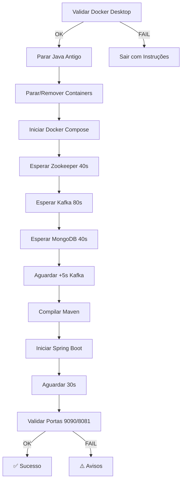

# 🔧 Refatoração dos Scripts de Startup

**Data**: 05/12/2025  
**Autor**: Marcos Pereira

## 📋 Problema Identificado

Os scripts `start.ps1` e `restart.ps1` falhavam quando o **Docker Desktop não estava rodando**, causando:

1. ❌ Aplicação Java iniciava sem Kafka disponível
2. ❌ Logs preenchidos com erros de conexão Kafka
3. ❌ Portas não abriam (8081, 9090)
4. ❌ Mensagens de erro confusas

### Erro Original
```
error during connect: Get "http://\\.\pipe\dockerDesktopLinuxEngine": 
The system cannot find the file specified
```

---

## ✅ Melhorias Implementadas

### 1. **Validação de Docker Desktop**
```powershell
function Test-DockerRunning {
    try {
        $null = docker ps 2>&1
        return $LASTEXITCODE -eq 0
    } catch {
        return $false
    }
}
```

**Comportamento**:
- ✅ Script verifica se Docker está rodando **antes** de qualquer operação
- ✅ Exibe mensagem clara se Docker estiver offline
- ✅ Instruções de como resolver (iniciar Docker Desktop)
- ✅ Aguarda usuário confirmar antes de sair

---

### 2. **Espera Inteligente por Serviços**
```powershell
function Wait-ForService {
    param(
        [string]$ServiceName,
        [int]$Port,
        [int]$MaxAttempts = 30
    )
    
    Write-Info "Aguardando $ServiceName (porta $Port)..."
    for ($i = 1; $i -le $MaxAttempts; $i++) {
        if (Test-Port -Port $Port) {
            Write-Info "$ServiceName disponível!"
            return $true
        }
        Start-Sleep -Seconds 2
    }
    
    Write-Error "$ServiceName não iniciou após $MaxAttempts tentativas"
    return $false
}
```

**Comportamento**:
- ✅ **Zookeeper**: máx 20 tentativas (40 segundos)
- ✅ **Kafka**: máx 40 tentativas (80 segundos) - mais tempo pois depende do Zookeeper
- ✅ **MongoDB**: máx 20 tentativas (40 segundos)
- ✅ Exibe logs do container se falhar

---

### 3. **Tratamento de Erros Melhorado**

#### **start.ps1**
```powershell
if (-not (Test-DockerRunning)) {
    Write-Error "Docker Desktop não está rodando!"
    Write-Warning "Por favor:"
    Write-Warning "  1. Inicie o Docker Desktop"
    Write-Warning "  2. Aguarde até ele estar completamente inicializado"
    Write-Warning "  3. Execute este script novamente"
    Read-Host "`nPressione ENTER para sair"
    exit 1
}
```

#### **restart.ps1**
- Mesma validação de Docker
- Logs redirecionados para `app.log` e `app-error.log`
- Validação de portas ao final (9090, 8081)
- Exibe health status da aplicação

---

### 4. **Limpeza de Containers Antigos**
```powershell
# Verificar se containers já estão rodando
$runningContainers = docker ps --format "{{.Names}}" 2>$null
if ($runningContainers -match "kafka|zookeeper|mongo") {
    Write-Warning "Containers já em execução. Recriando para garantir estado limpo..."
    docker-compose -f docker-compose.dev.yml down --remove-orphans
    Start-Sleep -Seconds 3
}
```

**Comportamento**:
- ✅ Detecta containers residuais
- ✅ Remove antes de recriar (evita conflitos)
- ✅ Usa `--remove-orphans` para limpar containers órfãos

---

### 5. **Tempo Extra para Kafka**
```powershell
Write-Info "Aguardando Kafka finalizar inicialização interna..."
Start-Sleep -Seconds 5
```

**Comportamento**:
- ✅ Aguarda 5 segundos extras após Kafka responder na porta 9092
- ✅ Garante que tópicos e brokers estejam prontos
- ✅ Evita erro "Broker may not be available"

---

## 📊 Comparação: Antes vs Depois

| Aspecto | ❌ Antes | ✅ Depois |
|---------|---------|----------|
| **Validação Docker** | ❌ Não verificava | ✅ Verifica e exibe instruções |
| **Espera Kafka** | ⏱️ Timeout genérico | ✅ 40 tentativas (80s) específicas |
| **Mensagens de Erro** | ❓ "The system cannot find..." | ✅ "Inicie o Docker Desktop" |
| **Limpeza Containers** | ⚠️ Às vezes conflitava | ✅ Recria containers sempre |
| **Logs da Aplicação** | 🔍 Console minimizado | ✅ Redirecionados para app.log |
| **Validação Final** | ❓ Sem verificação | ✅ Testa portas 8081, 9090 e health |
| **Tempo de Espera** | ⏱️ 30s fixo | ✅ Dinâmico por serviço |

---

## 🚀 Como Usar os Novos Scripts

### **Primeiro Start (Build Completo)**
```powershell
.\start.ps1
```

**Parâmetros opcionais**:
```powershell
.\start.ps1 -Rebuild      # Rebuild completo (mvn clean install)
.\start.ps1 -SkipBuild    # Pula compilação (usa JAR existente)
```

---

### **Restart (Limpeza Completa)**
```powershell
.\restart.ps1
```

**O que faz**:
1. 🛑 Para processos Java
2. 🔄 Reinicia Docker (com `-v` para limpar volumes)
3. 🧹 Limpa target (`mvn clean`)
4. 🔨 Compila (`mvn compile`)
5. 📦 Empacota (`mvn package`)
6. ▶️ Inicia aplicação com logs redirecionados

---

## 🔍 Verificação de Logs

### **Logs da Aplicação Java**
```powershell
# Ver últimas 50 linhas
Get-Content app.log -Tail 50

# Seguir logs em tempo real
Get-Content app.log -Tail 50 -Wait

# Ver erros
Get-Content app-error.log -Tail 50
```

### **Logs dos Containers Docker**
```powershell
# Todos os containers
docker-compose -f docker-compose.dev.yml logs -f

# Kafka específico
docker-compose -f docker-compose.dev.yml logs kafka --tail 100

# MongoDB específico
docker-compose -f docker-compose.dev.yml logs mongodb --tail 50
```

---

## 🎯 Validação Manual

### **1. Verificar Portas**
```powershell
Test-NetConnection -ComputerName localhost -Port 9090  # gRPC
Test-NetConnection -ComputerName localhost -Port 8081  # HTTP/Actuator
Test-NetConnection -ComputerName localhost -Port 9092  # Kafka
```

### **2. Health Check**
```powershell
curl http://localhost:8081/actuator/health
```

**Resposta esperada**:
```json
{
  "status": "UP"
}
```

### **3. Verificar Containers**
```powershell
docker ps --filter "name=kafka" --filter "name=zookeeper" --filter "name=mongo"
```

**Esperado**: 3+ containers com status "Up"

---

## 📝 Checklist de Troubleshooting

Se o script falhar, verifique:

- [ ] Docker Desktop está rodando?
  ```powershell
  docker ps
  ```

- [ ] Portas estão livres? (9090, 8081, 9092, 27017, 2181)
  ```powershell
  netstat -ano | findstr "9090 8081 9092 27017 2181"
  ```

- [ ] Java 17+ instalado?
  ```powershell
  java -version
  ```

- [ ] Maven instalado?
  ```powershell
  mvn --version
  ```

- [ ] Disco com espaço suficiente?
  ```powershell
  Get-PSDrive C
  ```

---

## 🔄 Sequência de Inicialização



---

## 📌 Resumo das Alterações

### **start.ps1** (357 linhas)
- ✅ Adicionada função `Test-DockerRunning()`
- ✅ Validação de Docker Desktop no início
- ✅ Espera inteligente por serviços (20-40 tentativas)
- ✅ Limpeza de containers antigos
- ✅ Tempo extra (5s) para Kafka
- ✅ Validação final de portas
- ✅ Exibição de health status

### **restart.ps1** (270 linhas)
- ✅ Adicionada validação de Docker Desktop
- ✅ Logs redirecionados (`app.log`, `app-error.log`)
- ✅ 6 passos bem definidos
- ✅ Validação de serviços ao final
- ✅ Resumo colorido (sucesso vs avisos)
- ✅ Comandos úteis no final

---

## 🎉 Resultado Final

Agora os scripts:
- ✅ **Detectam** se Docker não está rodando
- ✅ **Explicam** como resolver o problema
- ✅ **Aguardam** serviços estarem prontos
- ✅ **Validam** que tudo está funcionando
- ✅ **Exibem** logs úteis em caso de erro
- ✅ **Fornecem** comandos para troubleshooting

**Nunca mais** a aplicação vai iniciar sem Kafka! 🚀
